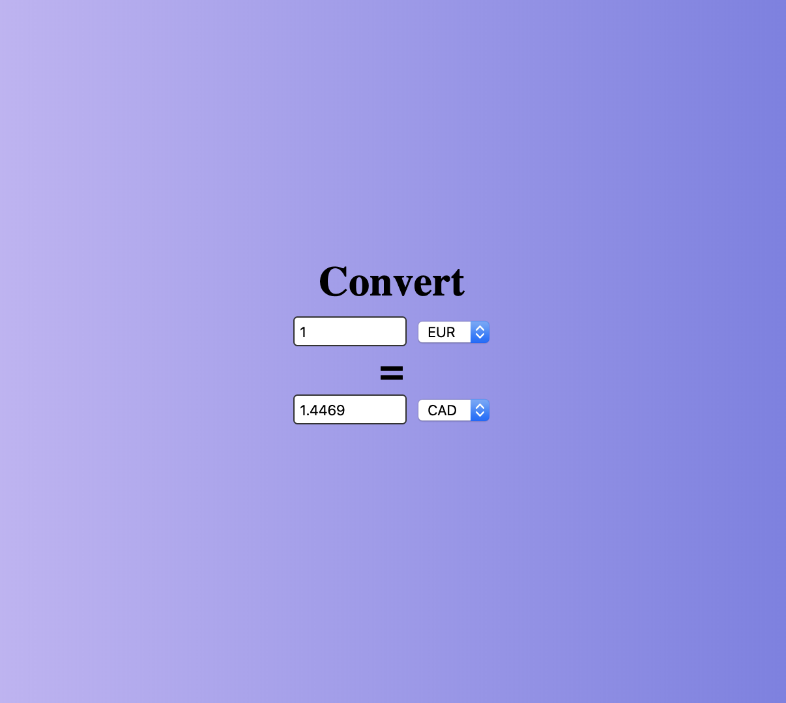
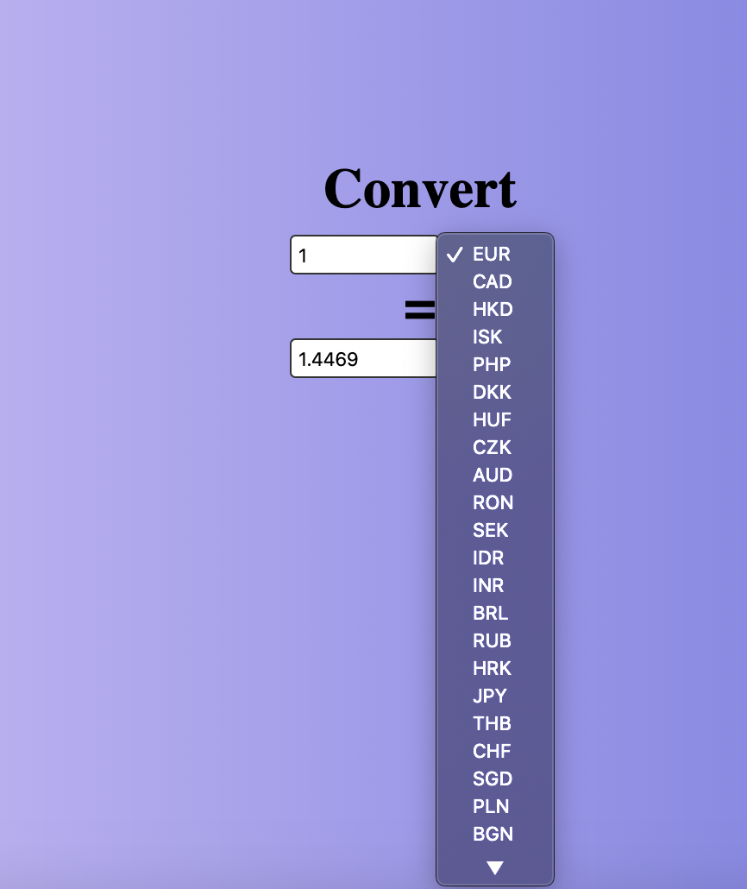

# Currency Converter
https://tranquil-temple-92834.herokuapp.com/
## Overview
The Currency Converter application is a basic React app that does real and up-to-date conversion on global currency.
## How it Works
The user clicks the link above and is brought to the app. The user can change the two types of currency to convert between and enter a number into one of the input boxes to see the conversion.
## Technologies Used
This application primarily runs on React. The API for the currency conversions is ExhangeRateAPI.
## Role
This is a solo project.
## Screenshots

